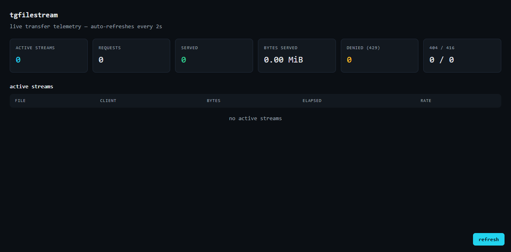

# tgfilestream-py

[](https://github.com/scar8969/tgfilestream-py/actions/workflows/ci.yml)
[](https://github.com/scar8969/tgfilestream-py)
[](https://github.com/scar8969/tgfilestream-py/blob/main/LICENSE)
[](https://github.com/scar8969/tgfilestream-py/actions/workflows/ci.yml)

Stream Telegram files over HTTP with byte-range resumption, parallel
multi-datacenter transfers, expiring one-time links and a live transfer
dashboard.

Send a file to the bot → get a direct download link → stream it with any
HTTP client, resume mid-download, or grab just the bytes you need.

```
Telegram ──MTProto──▶ bot ──link──▶ HTTP client
                          │
                          ├─ /<token>/<name>   byte-range streaming (RFC 7233)
                          ├─ /healthz          live telemetry JSON
                          └─ /                 live dashboard
```



## Why this exists

Telegram's own apps download files over MTProto with parallel connections
to multiple datacenters. Exposing those files over plain HTTP is usually
done by downloading the whole file first — which wastes bandwidth, memory
and time for large media. This service streams directly from Telegram's
storage to the HTTP client, so a video player or download manager can seek
to any byte offset without the server ever holding the file in memory.

## Features

| Feature | What it does |
|---|---|
| Byte-range streaming | `Range:` / `Content-Range:` / `Accept-Ranges: bytes` (RFC 7233), incl. suffix ranges |
| Parallel multi-DC transfer | A requested range is striped across up to `CONNECTION_LIMIT` parallel MTProto connections per datacenter |
| Expiring links | `LINK_TTL` seconds; links are purged after expiry (0 = never) |
| One-time links | `ONE_TIME_LINKS=1` — a link can be downloaded exactly once, enforced atomically under concurrency |
| Per-IP rate limiting | `REQUEST_LIMIT` concurrent streams per client IP (429 beyond) |
| Live dashboard | Active streams, bytes served, per-stream rate, error counters — auto-refresh |
| Demo mode | `DEMO_MODE=1` serves seeded in-memory files — run the whole stack with zero API credentials |
| HEAD support | Correct headers for download managers / video players |

## Quick start

### Demo mode (no Telegram account needed)

```bash
pip install -e .
DEMO_MODE=1 PORT=8080 python -m tgfilestream
```

Then:

```bash
# full download
curl -O http://localhost:8080/demo1/demo_one.bin

# resumable: grab bytes 0-1023, then resume from 1024
curl -r 0-1023 http://localhost:8080/demo1/demo_one.bin -o part.bin
curl -r 1024- http://localhost:8080/demo1/demo_one.bin -o - >> part.bin

# HEAD (what video players / download managers send first)
curl -I http://localhost:8080/demo1/demo_one.bin

# live dashboard
open http://localhost:8080/
```

Demo links: `/demo1/demo_one.bin`, `/demo2/demo_two.bin`,
`/demo3/demo_hello.txt`.

### Real mode

1. Get API credentials at https://my.telegram.org/apps
2. Run:

```bash
export TG_API_ID=12345
export TG_API_HASH=your_hash
export PUBLIC_URL=https://files.example.com   # behind a reverse proxy
python -m tgfilestream
```

3. Message the bot privately with any file. It replies with a download
   link: `https://files.example.com/<token>/<filename>`.

## Configuration

| Variable | Default | Description |
|---|---|---|
| `TG_API_ID` / `TG_API_HASH` | — | Telegram API credentials (required in real mode) |
| `PORT` / `HOST` | `8080` / `localhost` | HTTP listen address |
| `PUBLIC_URL` | `http://localhost:8080` | Public base URL used in bot replies |
| `LINK_TTL` | `0` | Link lifetime in seconds (0 = never expires) |
| `ONE_TIME_LINKS` | `false` | Invalidate a link after first download |
| `REQUEST_LIMIT` | `5` | Max concurrent streams per client IP |
| `CONNECTION_LIMIT` | `20` | Max parallel MTProto connections per datacenter |
| `DEMO_MODE` | `false` | Serve seeded in-memory files, no Telegram needed |
| `TRUST_FORWARD_HEADERS` | `false` | Honour `X-Forwarded-For` behind a proxy |
| `TG_SESSION_NAME` | `tgfilestream` | Telethon session file name |

## Architecture

```
tgfilestream/
├── __main__.py        entry point: wires config → services → server
├── config.py          environment-driven settings
├── bot.py             Telegram event handlers (file → link)
├── links.py           link registry: expiry + one-time semantics
├── source.py          file source abstraction
│   ├── DemoFileSource       in-memory store (demo mode / tests)
│   └── TelegramFileSource   real Telegram-backed source
├── paralleltransfer.py  range striping across parallel MTProto connections
├── web_routes.py      HTTP: streaming download, healthz, dashboard
├── telemetry.py       live transfer counters + active-stream tracking
└── util.py            ID packing, file-name extraction, helpers
```

The `FileSource` interface decouples the HTTP layer from Telegram: the
same web stack serves demo fixtures and real Telegram media, and the
whole HTTP layer is unit-testable without credentials.

## Verified numbers

Measured on this repo, CI (Python 3.11 + 3.12, GitHub Actions):

| Metric | Value |
|---|---|
| Test suite | 30 tests, 100% pass on both Python 3.11 and 3.12 |
| Test coverage | range parsing, one-time-link concurrency, rate limiting, parallel striping, HEAD, 404/416, telemetry |
| Parallel transfer | 128 KiB parts, up to `CONNECTION_LIMIT` concurrent MTProto connections |
| Byte-range accuracy | full download, `bytes=0-1023`, `bytes=100-`, `bytes=-500` all byte-exact vs source |
| Link semantics | one-time link: 200 on first GET, 404 on second; expiry enforced at claim time |
| Rate limiting | `REQUEST_LIMIT=1` → second concurrent stream from same IP returns 429 |
| Demo mode | zero API credentials; seeded files served with deterministic `/demo1`..`/demo3` links |

## Tests

```bash
pip install -e ".[dev]"
python -m pytest
```

30 tests covering: range parsing (absolute / open-ended / suffix /
unsatisfiable), one-time link single-use + concurrent-burst single-winner,
link expiry, per-IP rate limiting, parallel transfer striping/ordering,
HEAD requests, 404/416 handling, and dashboard telemetry.

## Deploy

`Procfile` is included for Railway / Heroku-style deploys:

```
web: python -m tgfilestream
```

Set `TG_API_ID`, `TG_API_HASH` and `PUBLIC_URL` in the platform's env
config. A reverse proxy (Caddy/nginx) is recommended for TLS; set
`TRUST_FORWARD_HEADERS=1` when you do.

## License

AGPL-3.0-or-later
